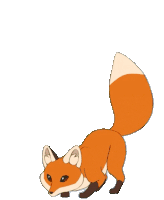

  

<h1 align="center">Hey there! I'm Rivi 👨‍💻</h1>

<!-- 

  A software engineer deeply passionate about system design and distributed systems.

 -->

## 🔍 About Me

- 👨‍💻 **Software Engineer** focused on building scalable, resilient systems.
- 🔁 Main stack: **Node.js (NestJS)** – expanding into **C#/.NET**.
- 📚 Lifelong learner with a strong focus on distributed systems and software architecture.
- ⚙️ Experienced with event-driven design patterns like **CQRS**, **Event Sourcing**, and **Saga**.
- 🧵 Love exploring concepts like **CAP Theorem**, **Sharding** and **Idempotency**.
- 🛠️ Currently studying **DevOps**, building CI/CD pipelines, and deploying containerized applications with **Docker** & **Kubernetes**.
- ✍️ Enjoy writing, mentoring, and contributing to technical communities.

<!-- --- -->

## 🚀 Learning Path & Focus

### 📘 Advanced Architecture
- Studied: *Clean Architecture*, *Designing Data-Intensive Applications*
- Practicing: CQRS, Event Sourcing, Saga Pattern

### 🌐 Distributed Systems
- Key Topics: CAP Theorem, Replication, Distributed Transactions, Resilience

### 🔄 DevOps & Observability
- Tools: Docker, Kubernetes, GitHub Actions, Prometheus + Grafana

<!-- --- -->

<!-- ## ✍️ Writing

- 📖 I write about Node.js architecture, clean backend patterns, and distributed system challenges.  
  → [Coming soon on Medium](https://medium.com) -->

<!-- --- -->

## 🔗 Links

<!--  -->

  <!-- 
  &nbsp;
  
  &nbsp;
  
  &nbsp;
   -->

---

> *"Software is a journey, not a destination."*
